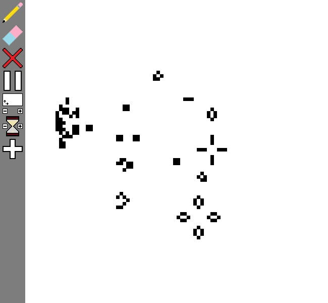

# Python-Pygame-Game-Of-Life

This is the Conway Game of Life coded using Pygame.
## Features
- Pause and play
- Possibility to change the grid size
- Possibility to change the frame delay
- Preset structures
## Installation
1. Download the repository by clicking on `Code > Download ZIP`
2. Extract the ZIP file
3. Run `main.pyw`
## Requirements
- Python 3.7
- Python os library
- Python contextlib library
- Python pygame library
- Python time library
## Usage
You can add preset structures using the `+` button, then you will need to type a name of a structure that you can find in the `Figures.txt` file.
You can rotate the pattern using `E`.
Also, you can switch to the next step using `R`.
And with `Q` you can mirror horizontaly the structure and vertically with `W`.
Finnaly you can press `ENTER` to validate.